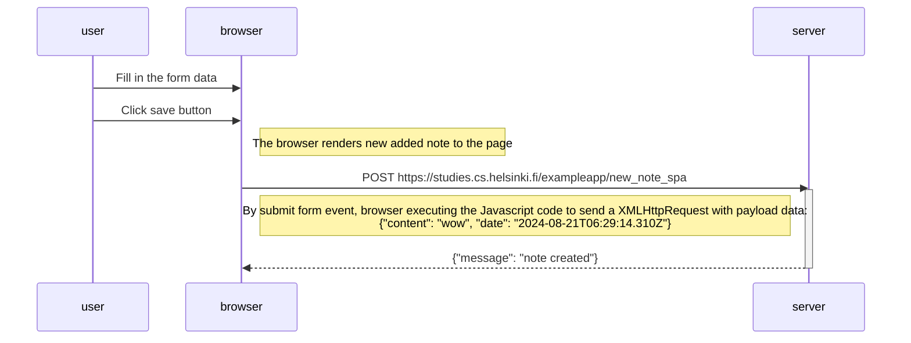

```mermaid
sequenceDiagram
    participant user
    participant browser
    participant server

    user->>browser: Fill in the form data
    user->>browser: Click save button
    
    Note right of browser: The browser renders new added note to the page
    
    browser->>server: POST https://studies.cs.helsinki.fi/exampleapp/new_note_spa
    activate server
    
    Note right of browser: By submit form event, browser executing the Javascript code to send a XMLHttpRequest with payload data: <br> {"content": "wow", "date": "2024-08-21T06:29:14.310Z"}
    
    server-->>browser: {"message": "note created"}
    deactivate server
```